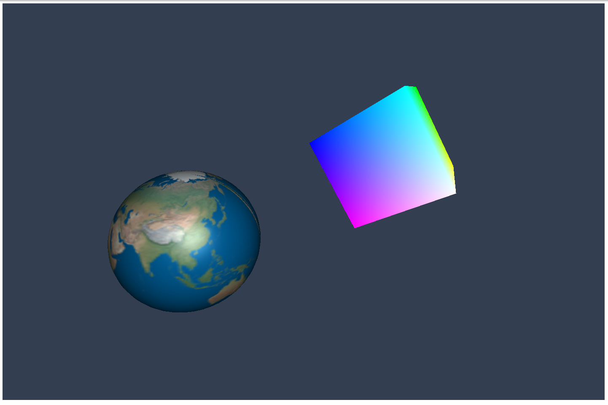

# Step-by-Step WebGPU Graphics Programming (52) 
## Create Multiple Objects using Different Pipelines

This is the source code for the 52th part of a series YouTube videos on step-by-step WebGPU graphics programming.

This sample WebGPU app creates multiple objects in a single scene using different render pipelines. The output from the app is shown in the following image.

## Link for All Source Code Used in the WebGPU Step-By-Step Video Series:

https://github.com/jack1232/WebGPU-Step-By-Step